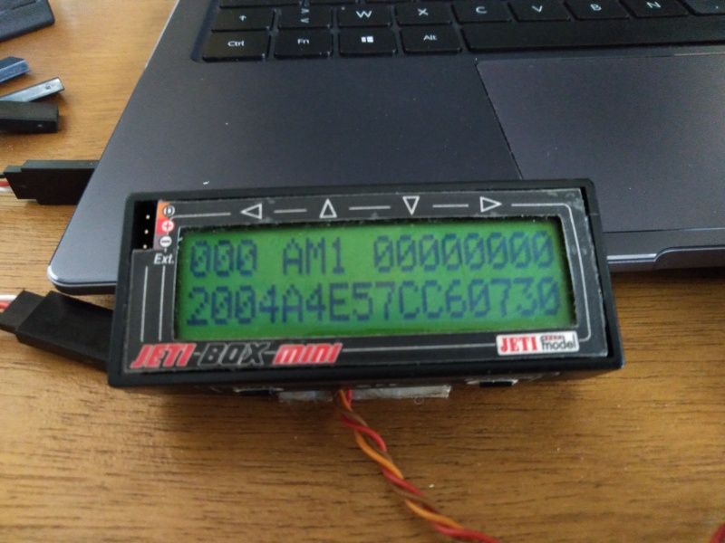

# Télémétrie Jeti


## Attention
Version très préliminaire, pas encore vraiment de la télémétrie, seuls de messages et quelques alertes (bips) sont générés.

La navigation dans les menus est opérationnelle et permet de changer les Groupe de modèles et plage de masse émis dans l'ID.

## Navigation

```
        ↓
+-- Menu Home ---+
|LaBalise  [GMMM]|   G : Groupe de modèle (1-modèles captifs, 2-planeurs, 3-trucs à rotors, 4-avions)
|   Beacon Status|   MMM : masse maximale en kilo (002, 004, 025; 150, 999)
+----------------+
      ↓   ↑
+--- Menu GPS ---+
|Satellites :  XX|   Nombre de satellites OK (min 4 pour que la balise émette)
|HDOP:      FF.FF|   Dispersion horizontale de la précision (max 4.0 pour que la balise émette)
+----------------+
      ↓   ↑
+--- Menu ID ----+
|000 AM1 00000000|   Identifiant complet émis par la balise
|GMMMABCDEF012345|
+----------------+
      ↓   ↑
+----------------++----------------++----------------++----------------+
|←G1     Captifs→||←G2    Planeurs→||←G3      Rotors→||←G4      Avions→|
| M002  0.8<kg<2 || M002  0.8<kg<2 || M002  0.8<kg<2 || M002  0.8<kg<2 |
+----------------++----------------++----------------++----------------+
                        ↓   ↑
                  +----------------++----------------++----------------++----------------++----------------+
                  | G2    Planeurs || G2    Planeurs || G2    Planeurs || G2    Planeurs || G2    Planeurs |
                  |←M002  0.8<kg<2→||←M004    2<kg<4→||←M025   4<kg<25→||←M150 25<kg<150→||←M999    kg>150→|
                  +----------------++----------------++----------------++----------------+-----------------+

Dans les deux sous-menus, les touches ← et →
permettent de boucler sur les valeurs possibles
La touche ↑ enregistre le groupe et la masse dans la balise
en retournant au menu ID
```

## Exemples

### Accueil


### État GPS


### Identifiant
