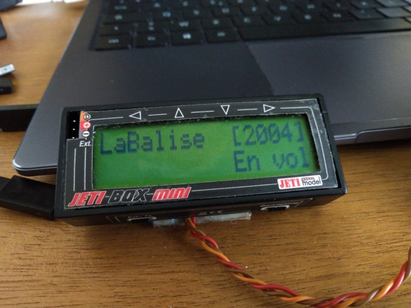
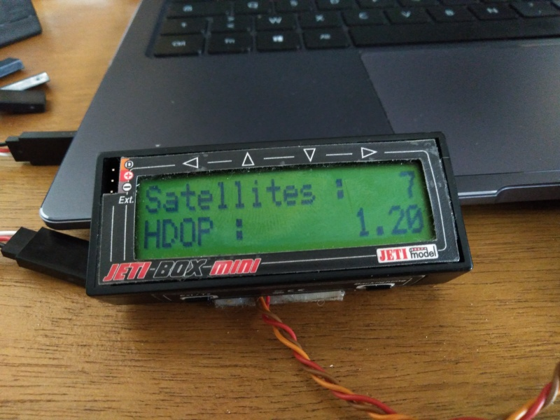

# Télémétrie Jeti


## Attention
Version très préliminaire, pas encore vraiment de la télémétrie, seuls de messages et quelques alertes (bips) sont générés.

La navigation dans les menus est opérationnelle et permet de changer les Groupe de modèles et plage de masse émis dans l'ID.

## Navigation

```
        ↓
+-- Menu Home ---+
|LaBalise  [GMMM]|   G : Groupe de modèle (1-modèles captifs, 2-planeurs, 3-trucs à rotors, 4-avions)
|   Beacon Status|   MMM : masse maximale en kilo (002, 004, 025; 150, 999)
+----------------+
      ↓   ↑
+--- Menu ID ----+
|000 AM1 00000000|   Identifiant complet émis par la balise
|GMMMABCDEF012345|
+----------------+
      ↓   ↑
+--- Menu GPS ---+
|Satellites :  XX|   Nombre de satellites OK (min 4 pour que la balise émette)
|HDOP:      FF.FF|   Dispersion horizontale de la précision (max 4.0 pour que la balise émette)
+----------------+
      ↓   ↑
+--- Réglages ---+         +--- Réglages ---+
|   *Reglages*   |    →    |   *Reglages*   |
| ID GROUPE [G] →|    ←    |←ID MASSE [MMM] |
+----------------+         +----------------+
      ↓   ↑                      ↓   ↑
+--- Réglages ---+         +--- Réglages ---+  Dans les deux sous-menus, les touches ← et →
|*Nouveau Groupe*|         |*Nouvelle Masse*|  permettent de boucler sur les valeurs possibles
|←   <Valeur>   →|         |←   <Valeur>   →|  La touche ↓ enregistre le groupe et la masse dans la balise
+----------------+         +----------------+  Déclenchement d'une tonalité à l'enregistrement
```

## Exemples

### Accueil


### Identifiant


### État GPS


### Menu d'accueil pour Changer du groupe de modèle


### Choix d'un nouveau groupe de modèle


### Menu d'accueil pour Changer de la plage masse


### Choix d'une nouvelle plage de modèle


### Identifiant et Accueil avec les nouvelles valeurs

